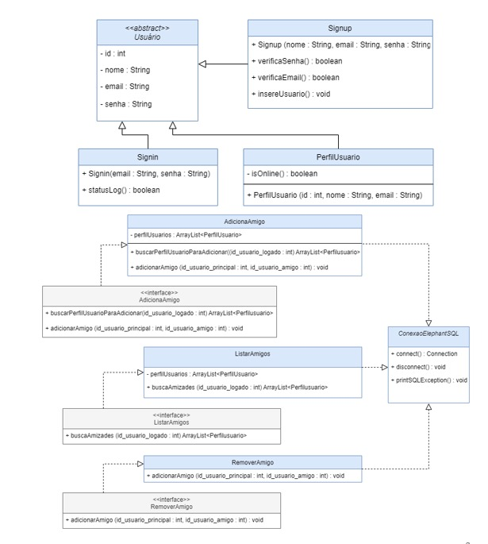
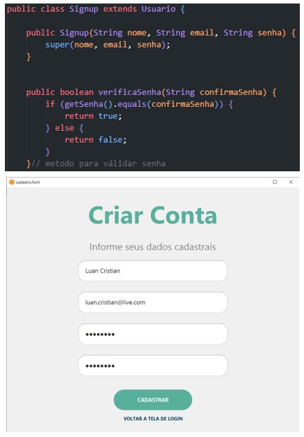
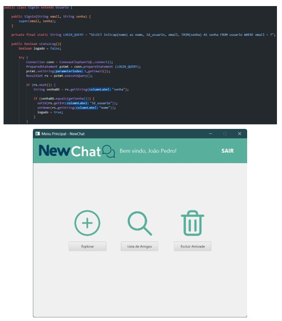
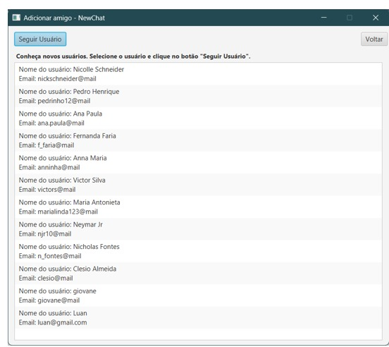

## Projeto de Rede Social - Newton Paiva

Projeto desenvolvido utilizando como base interfaces de redes sociais comuns como Facebook e Instagram, levando em conta os itens propostos para o trabalho como as telas de login, cadastro, visualização de conexões e futuras, bem como sua interação entre as telas e a comunicação com a base de dados construída para o armazenamento dados da rede social.

Relacionamento entre as telas do aplicativo:

Exemplo de criação de usuário:

Exemplo de navegação:

Exemplo de busca por usuários para seguir:

Para mais detalhes, há uma documentação completa sobre todas as fases clicando neste [Link](https://github.com/fsaantiago/Trabalho_final_POO/tree/main/projeto-final/relatorio)

## Stack utilizada

**IDEs:** VS Code, SceneBuilder.

**Back-end:** Java, JavaFX.

**Banco de Dados:** PostgreSQL.
